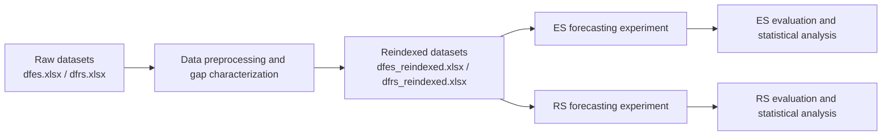

# Wind Power Forecasting Experiments — Espírito Santo and Rio Grande do Sul

This repository contains the reproducible data-preparation and forecasting workflow used in a master's research project on short-term wind power forecasting.

The study considers two time-series datasets from Brazil:

- **Serra, Espírito Santo (ES)** — 15-minute temporal resolution
- **Santa Vitória do Palmar, Rio Grande do Sul (RS)** — hourly temporal resolution

The repository is organized as a sequential pipeline: the raw datasets are first cleaned, temporally aligned, reindexed, and characterized for missing data. The generated datasets are then used as input to the ES and RS forecasting notebooks.

---

## Research workflow



The experiment notebooks should **not** be executed from the raw data directly.  
First run the preprocessing pipeline and generate the reindexed datasets. These files are the inputs to the forecasting experiments.

---

## Repository structure

Recommended structure:

```text
.
├── README.md
├── requirements.txt
│
├── notebooks/
│   ├── ES_Experimento_Final_Junho2026.ipynb
│   └── RS_Experimento_Final_Junho2026.ipynb
│
├── data_preprocessing/
│   ├── DATA_IN_BRIEF_data_preprocessing_and_gap_characterization_pipeline.ipynb
│   ├── README.md
│   └── outputs/
│       └── reindexed/
│           ├── dfes_reindexed.xlsx
│           └── dfrs_reindexed.xlsx
│
└── results/
    ├── ES/
    └── RS/
```

The `data_preprocessing/README.md` contains the detailed description of the preprocessing and gap-characterization procedure. This root README describes how that pipeline connects to the forecasting experiments.

---

## 1. Data preprocessing

The first stage of the workflow is implemented in:

```text
data_preprocessing/
└── DATA_IN_BRIEF_data_preprocessing_and_gap_characterization_pipeline.ipynb
```

The preprocessing pipeline performs operations including:

- cleaning and filtering inconsistent observations;
- timestamp construction and temporal ordering;
- reindexing the time series to a regular temporal frequency;
- identification of missing timestamps;
- creation of missing-data indicators;
- characterization of gap lengths.

### Input files

Place the source datasets required by the preprocessing notebook in the location expected by that notebook:

```text
dfes.xlsx
dfrs.xlsx
```

### Generated files

After running the complete preprocessing notebook, the following datasets must exist:

```text
data_preprocessing/outputs/reindexed/dfes_reindexed.xlsx
data_preprocessing/outputs/reindexed/dfrs_reindexed.xlsx
```

These two files form the interface between the preprocessing stage and the forecasting experiments.

---

## 2. Running the forecasting experiments

After the reindexed datasets have been generated, run the notebooks in:

```text
notebooks/
```

### Espírito Santo experiment

```text
notebooks/ES_Experimento_Final_Junho2026.ipynb
```

Recommended input configuration:

```python
from pathlib import Path
import pandas as pd

DATA_PATH = Path("../data_preprocessing/outputs/reindexed/dfes_reindexed.xlsx")

df = pd.read_excel(DATA_PATH)

# Compatibility with the preprocessing output
if "timestamp" not in df.columns and "data_hora" in df.columns:
    df = df.rename(columns={"data_hora": "timestamp"})
```

The ES dataset has a temporal resolution of **15 minutes**. Therefore, the forecasting horizons from one to six hours correspond to:

| Forecast horizon | Number of 15-min steps |
|---|---:|
| 1 hour | 4 |
| 2 hours | 8 |
| 3 hours | 12 |
| 4 hours | 16 |
| 5 hours | 20 |
| 6 hours | 24 |

---

### Rio Grande do Sul experiment

```text
notebooks/RS_Experimento_Final_Junho2026.ipynb
```

Recommended input configuration:

```python
from pathlib import Path
import pandas as pd

DATA_PATH = Path("../data_preprocessing/outputs/reindexed/dfrs_reindexed.xlsx")

df = pd.read_excel(DATA_PATH)

# Compatibility with the preprocessing output
if "timestamp" not in df.columns and "data_hora" in df.columns:
    df = df.rename(columns={"data_hora": "timestamp"})
```

The RS dataset has an **hourly** temporal resolution. Thus, the forecasting horizons correspond directly to one through six time steps.

| Forecast horizon | Number of hourly steps |
|---|---:|
| 1 hour | 1 |
| 2 hours | 2 |
| 3 hours | 3 |
| 4 hours | 4 |
| 5 hours | 5 |
| 6 hours | 6 |

---

## 3. Experiment pipeline

After loading the reindexed datasets, the experiment notebooks perform additional transformations required specifically for forecasting.

The main stages are:

1. **Gap inspection and characterization**
2. **Evaluation of imputation strategies**
3. **Construction of continuous temporal blocks**
4. **Imputation of selected numerical variables**
5. **Temporal feature engineering**
6. **Creation of the turbine cut-in indicator**
7. **Lag-based supervised learning transformation**
8. **Time-series cross-validation**
9. **Model training**
10. **Evaluation by forecast horizon**
11. **Statistical comparison between models**

The turbine operating-regime indicator used in the experiments is based on a cut-in wind speed of **3.6 m/s**.

---

## 4. Forecasting models

The final experiment notebooks include comparisons involving:

- **Persistence** as a forecasting baseline;
- **LightGBM**;
- **GRU**;
- **LSTM**;
- hyperparameter optimization with **Optuna**.

The RS notebook additionally contains a **Random Forest** experiment.

Deep-learning models are trained using sequential representations reconstructed from the lagged time-series features.

---

## 5. Validation strategy

The experiments use temporal validation rather than random train/test splitting.

A `TimeSeriesSplit` strategy with **five folds** is used so that model evaluation respects the chronological ordering of the time series and reduces the risk of temporal leakage.

For reproducibility, the notebooks define:

```python
RANDOM_SEED = 42
```

where applicable.

---

## 6. Evaluation metrics

Forecast quality is evaluated independently for each prediction horizon using:

- **MAE — Mean Absolute Error**
- **RMSE — Root Mean Squared Error**
- **R² — Coefficient of Determination**

Two operating scenarios are analyzed:

- **Complete dataset** — all valid observations;
- **Above cut-in** — evaluation focused on periods in which wind speed is above the turbine cut-in threshold.

The notebooks also include statistical comparisons using non-parametric tests such as:

- **Friedman test**
- **Wilcoxon signed-rank post-hoc comparisons**

---

## 7. Environment and dependencies

A dedicated Python environment is recommended.

Example:

```bash
python -m venv .venv
source .venv/bin/activate
```

On Windows:

```bash
.venv\Scripts\activate
```

Install the project dependencies:

```bash
pip install -r requirements.txt
```

A `requirements.txt` should include at least:

```text
numpy
pandas
openpyxl
matplotlib
seaborn
scikit-learn
scipy
lightgbm
optuna
scikit-posthocs
tensorflow
jupyter
```

For strict reproducibility, package versions should be pinned to the versions used to generate the final dissertation results.

---

## 8. Reproducing the complete study

The expected execution order is:

```text
1. Obtain the original ES and RS datasets
        ↓
2. Run the data-preprocessing notebook
        ↓
3. Confirm creation of:
   - dfes_reindexed.xlsx
   - dfrs_reindexed.xlsx
        ↓
4. Run ES_Experimento_Final_Junho2026.ipynb
        ↓
5. Run RS_Experimento_Final_Junho2026.ipynb
        ↓
6. Export and compare model metrics and statistical results
```

In short:

> **Raw data → preprocessing → reindexed datasets → forecasting notebooks → model evaluation**

This execution order is important because the forecasting notebooks assume that the temporal alignment and reindexing stages have already been completed.

---

## 9. Results

The notebooks generate model-performance tables and intermediate result files, including CSV outputs for individual models and scenarios.

For a cleaner repository, generated experiment files should be stored under:

```text
results/ES/
results/RS/
```

rather than in the repository root or inside the notebook directory.

Large intermediate files and model artifacts that can be regenerated should generally not be versioned unless they are required for reproducing the reported results.

---

## 10. Reproducibility notes

Before executing the notebooks, verify that:

- the preprocessing notebook has completed successfully;
- the two reindexed Excel files exist;
- the input paths in both experiment notebooks point to the preprocessing outputs;
- the timestamp column is consistently named `timestamp`;
- package versions are compatible with the saved notebooks;
- notebooks are executed from the repository structure described above.

Avoid manually copying or renaming generated datasets between stages. Relative paths should connect the preprocessing outputs directly to the experiment notebooks.

---

## Citation

If you use this repository in academic work, please cite the corresponding master's dissertation and any associated publication.

```bibtex
@mastersthesis{author_year_wind_forecasting,
  author = {Author},
  title  = {Dissertation title},
  school = {Institution},
  year   = {Year}
}
```

Replace the placeholder citation above with the final dissertation metadata.

---

## License

This project is distributed under the **MIT License**, unless otherwise stated for individual datasets.

Data usage may be subject to additional restrictions depending on the original data sources.

